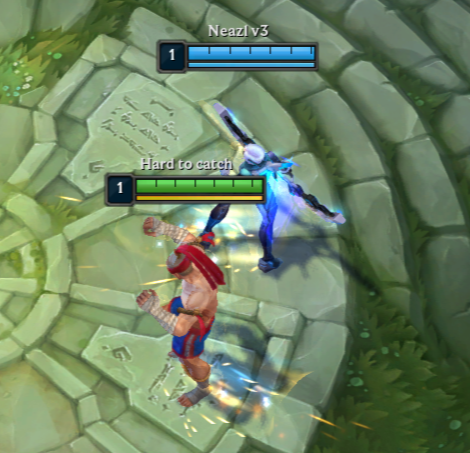
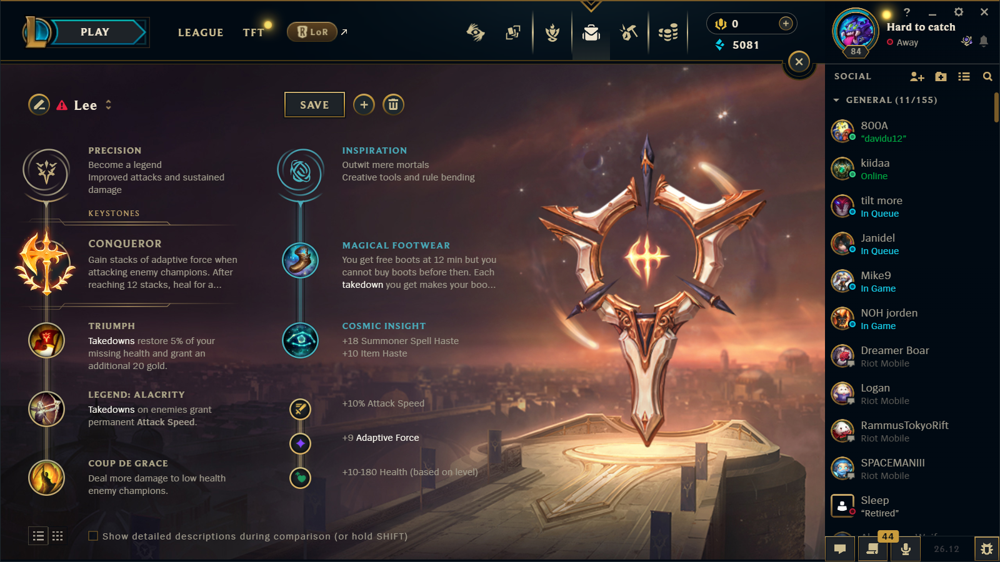
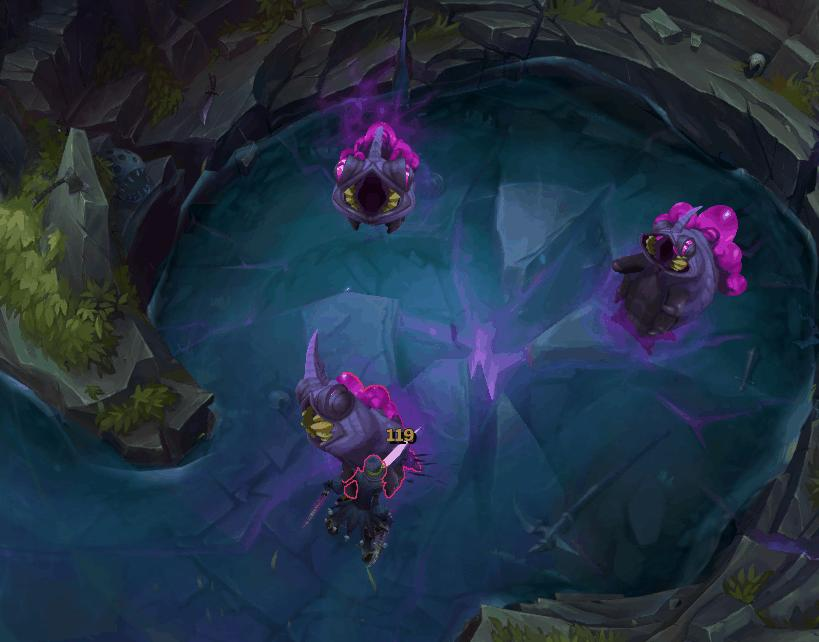

Da quando ho iniziato il nuovo lavoro ho incontrato colleghi nuovi, a parte le solite cazzate che facciamo a lavoro adoriamo giocare a biliardino.
Il livello è altissimo, tuttavai è uscito nuovamente League of Legends, e per un motivo e l'altro mi hanno ritirato dentro a giocare.

Con questo gioco avevo smesso, per due motivi principali:

1. Il tempo: consuma una grandissima quantità di tempo, e dovevo concludere la triennale (e poi decisi anche di fare la magistrale).
2. La tossicità intrinseca della community: questo è un punto risaputo, LoL ha la community più tossica di qualsiasi gioco online.

Tuttavia mi mancava, rigiocandoci sono emersi i ricordi di quando distruggevo la SoloQ con il mio Lee Sin. Ho anche rivisto i vecchi video che avevo fatto, e niente ci sono ricaduto.

Ho ripreso a giocare, seppure le meccaniche principale del MOBA sono le stesse, il gioco è cambiato parecchio. Quindi sfrutto questo blog post per rinfrescarmi un po' tra rune, mob nuovi, giungla nuova, ecc.

## Rune

Queste non sono cambiate dall'ultima volta che giocavo Lee Sin

**Ramo precisione**:
* Conqueror: quando colpisci un nemico puoi accumulare fino a 12 stack, ciascuno stack ti da AD adattivo in base al livello. Al massimo di stack ti curi per l'8% di danni che effettui ai nemici. **Sei più forte nei fight lunghi.** La durata di uno stack dovrebbe essere di 5 secondi.
* Takedowns: ripristinano il 5% della tua vita mancante e ti danno 20 gold extra.
* Legend (Alacrity): takedown sui nemici ti garantiscono **attack speed** permanente.
* Coup de Grace: Fai più danno ai nemici con poca vita.

**Ramo ispirazione**:
* Magical footwear: al minuto 12 ottieni delle scarpe gratis (ma non puoi comprartele prima). Ogni takedown che ottieni ti accorcia questa ricompensa di 45 secondi. Hanno 10 **movement speed** aggiuntivo.
* Cosmic Insight: **+18 Summoner Spell Haste** (CDR ridotto su tutte summoner spells, es. Flash) e **+10 Item Haste** (CDR ridotta anche per gli item).

**Shards**:
* **+10% Attack Speed**
* **+9 Adaptive Force**
* **+10-180 Health** (Adattivo in base al livello)

## Build (WIP)

## Giungla (WIP)

I timer sono da rivedere, ma sembra che tutti partano allo stesso momento.

### Draghi (WIP)

Diversi tipi di draghi:
* Infernal
* Cloud
* Hextech
* Chemtech
* Elder dragon

### Herald

La cosa strana rispetto a qundo avevo lasciato l'herald è che ora ci si può entrare dentro.

### Voidgrub

Questo è un campo relativamente nuovo per me, in italiano si chiamano le “Larve del Vuoto” (Voidgrubs). Sono mostri neutrali che compaiono nella fossa dell’Herald/Nashor al minuto ~8:00 (non 6:00).

Sono tre. Non respawnano: il campo non ha una vera e propria seconda spawn, ma in alcune patch iniziali era stato testato un sistema a due ondate; oggi nella versione attuale sono un unico spawn per partita.

Al minuto ~14:45 vengono rimossi dal gioco e la fossa viene poi usata per il Rift Herald, che spawna alle 15:00.

Sono tre, ChatGPT mi dice che possono respawnare una seconda volta.

Al minuto 14:00 vengono sotituiti dall'Herald.

*Okay, ma a che cosa servono?*

Danno dei gold, ma neanche tantissimi, ciascuno conta come mostro della giungla, quindi significa che può essere contato come stack sull'item principale della giungla.

Il vero buff è il "Touch of the Void", ha un effetto base e degli effetti che cambiano in base agli stack accumulati (uno per void grub).
* **Effetto base**: attacchi alle strutture infliggono danno nel tempo (true damage).
* **Dopo 3 stack**: Ottieni *hunger of the void*, le torri diventano più facili da abbattere ed evochi i **Voidmites**, piccoli minion, quando attacchi le torri.

In pratica è un buff da early game per snowballare sulle prime torri.

